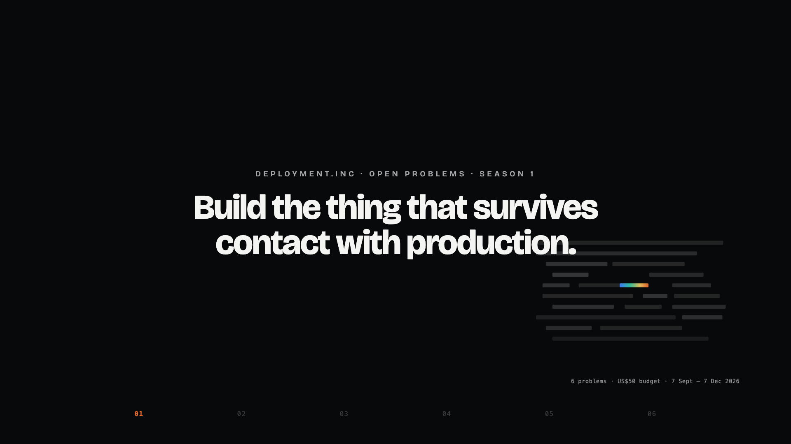

  

  

<h1 align="center">Deployment.inc Open Problems — Season 1</h1>

<b>Six AI engineering challenges. Pick one, show your work, and explain your decisions. Strong submissions lead to one technical conversation with our engineers.</b>

  <a href="#the-problems">Pick a problem</a> ·
  <a href="#what-you-get">What you get</a> ·
  <a href="#how-we-evaluate">How we evaluate</a> ·
  <a href="#common-rules">Rules</a> ·
  <a href="#submission">Submit</a> ·
  <a href="#faq">FAQ</a> ·
  <a href="CONTACT.md">Ask a question</a>

> **Submissions are open: 7 September – 7 December 2026 (23:59 IST).** [Submit your work privately](https://deployment.inc/hiring-challenges/#submit). See [RELEASE_STATUS.md](RELEASE_STATUS.md) for the release and review checks.

---

## Why this exists

A working demo leaves important questions unanswered: what happens when an upstream changes,
which requests cost too much, whether a tool action was authorised, and how a business owner
knows it is safe to keep running. These are the questions our forward-deployed engineers work on.

This board asks you to build a system, measure its limitations, make a defensible decision,
and explain that decision to the person accountable for operating it.

## What you get

| | |
|---|---|
| **The process** | One technical conversation with the engineers you'd work with. No further rounds. After it, both sides decide. |
| **The role** | Forward-deployed engineer, embedded with an enterprise client alongside the Deployment.inc team. Open roles and locations are listed on [deployment.inc](https://deployment.inc). |
| **Effort** | Budget 20–50 hours per problem (10–20 for the Starter problem). Do one problem; a second earns nothing extra. |
| **Cost to you** | The submitted runs must stay within **US$50 of API usage at the pinned list prices**. This is a usage ceiling, not a grant. You cover your own development and submission costs; Deployment.inc provides no candidate credits or reimbursements. Optional third-party offers are linked in [FREE_CREDITS.md](FREE_CREDITS.md). |
| **What this is not** | Not work for us. Participation is voluntary and non-exclusive. Your work stays yours; keep submission-specific code, methods and results private through the season, and withdraw at any time through the private contact route. Not an offer of employment: we may not have a role for every strong submission, and if so we say it plainly. |

We evaluate without regard to age, gender, caste, religion, disability, nationality or where you studied. If you need an accommodation — an extended window, an alternative to a paid service, a different hardware path — say so through [CONTACT.md](CONTACT.md) before you start; asking never counts against you.

---

## The Problems

Three categories. **Core** problems set a bar on a public benchmark and ask you to engineer past it. **Applied** problems are shaped like the engagements we actually run: no benchmark, a published contract and hidden test sets, graded as the buyer would grade them. The **Starter** problem is sized for people early in their career.

| # | Category | Problem | You report to | Built on |
|---|---|---|---|---|
| 01 | Core | [Ship the Thing You Inherited](problems/OP-01-ship-the-thing-you-inherited.md) | Head of platform engineering | Harbour |
| 02 | Core | [The Deprecation Notice](problems/OP-02-the-deprecation-notice.md) | VP of engineering | Harbour |
| 03 | Core | [Ten Times Cheaper](problems/OP-03-ten-times-cheaper.md) | CFO | Harbour |
| 04 | Core | [Judge Without Ground Truth](problems/OP-04-judge-without-ground-truth.md) | Product owner | Harbour trajectories |
| 05 | Applied | [Ask the Policy Book](problems/OP-05-ask-the-policy-book.md) | Head of compliance | IndiaFinBench + Harbour policy |
| 06 | Starter | [Triage the Inbox](problems/OP-06-triage-the-inbox.md) | Customer-support manager | ABCD |

**Which one is for me?**

- **01–04 (Core)** all run against **Harbour**, a loan-servicing agent we wrote ourselves. Four different jobs on one system: make it shippable, survive a forced model change, make its economics work, and know whether it is working at all.
- **05 (Applied)** is compliance retrieval over real financial regulation, with citations, access control and freshness.
- **06 (Starter)** is sized for people early in their career. Same rubric, smaller scope, honest about it.

Doing one problem is the whole ask. Because 01–04 share an environment, the setup you do for one carries to the others if you want to attempt a second — but a second earns nothing extra.

Every problem names a stakeholder, states a bar, and lists what is yours to decide. Terms like task success and calibration error are defined once in the [glossary](GLOSSARY.md).

---

## How We Evaluate

Every submission is scored on seven dimensions. [JUDGMENT_REVIEW.md](JUDGMENT_REVIEW.md) explains the evidence and the technical conversation for all six problems. The rubric is public because we want you to optimize for it.

| Dimension | What we look at |
|---|---|
| **1. Did it work?** | We validate artifacts, recompute the metrics that those artifacts support, and reproduce eligible work in an isolated environment. Missing evidence is pending, never a pass. We explain discrepancies and let you correct packaging errors. Qualification requires the published problem bars and engineer review. |
| **2. Do you know why?** | Failure taxonomy of the baseline. Which intervention moved which failure category. Ablations that show what did *not* work. |
| **3. Would it survive production?** | Error handling, idempotency, timeouts, retries, observability, tests, a runbook. Does it restart cleanly? What happens at 10× load or when the upstream API returns garbage? |
| **4. Did you make the right trade-offs?** | Cost per task, latency, approval overhead, what you cut and why. Every problem requires cost reporting; we look at how you spent under it. |
| **5. Can a business owner act on it?** | `MEMO.md`: one page to a named non-technical stakeholder. What it does, what it doesn't, what it costs, what breaks, what you'd do next quarter. |
| **6. Did you report honestly?** | `EXPERIMENT_LOG.md` with dates and dead ends. Failed runs reported. Limitations stated up front. |
| **7. Did you know what already exists?** | `LANDSCAPE.md`: the frameworks, papers, models and vendor products you evaluated, what you adopted, what you rejected and the evidence for each. Reinventing a solved component is a signal; so is adopting a fashionable one without measuring it. |

Three outcomes:

- **Qualified** — bar crossed, recomputed by us, confirmed where a full benchmark exists. We invite you to one technical conversation with our engineering leads.
- **Honorable** — bar not crossed, but the experiment log shows rigorous work, real understanding of why the bar was hard, and honest reporting. Also invited. A well-documented negative result beats an unexplained positive one. A negative result can demonstrate excellent engineering judgment.
- **Frontier** — a result that, on full reproduction, substantially improves the frozen reference on the published task, with reproducible components. We independently reproduce the result. Any public write-up happens only after the season closes and with your separate, explicit consent; recognition does not require publication.

No LeetCode, no five-round loop. This is the whole interview process.

Automated checks are scripts. Language-model tooling helps us organise evidence and draft interview questions. Its output is advisory. Every submission that passes the checks is read by an engineer, and no outcome is decided by a model alone. See [PRIVACY.md](PRIVACY.md) for what we keep and for how long.

---

## Common Rules

Unless a problem explicitly overrides them:

**Your submission must contain:**

- a separate **private GitHub repository**, shared only with the designated reviewers in [CONTACT.md](CONTACT.md). Your work stays yours; a private evaluation-only licence is sufficient. Do not use GitHub's Fork button for your solution: forks of a public repository are public;
- exact model snapshot strings, benchmark commits and dependency versions;
- `scripts/reproduce.sh` that reproduces your results or starts the required service from a clean machine, with documented modes and no GPU;
- **raw benchmark outputs** in `results/raw/` (every run, including failed ones), not just a table. Outputs over 100 MB may live in an access-controlled private release or artifact store shared only with reviewers, with SHA-256 listed in the manifest. An unlisted or hard-to-guess public URL is not private;
- `results/manifest.json` in the per-problem schema ([`SUBMISSION_SCHEMA.md`](SUBMISSION_SCHEMA.md));
- **measured** spend for the runs in `results/`: API dollars at pinned list prices, GPU-hours at a disclosed rate, free-tier compute at the rental rate of the same GPU;
- `EXPERIMENT_LOG.md` — dated, including what didn't work;
- `DECISIONS.md` — the scope and design decisions you made where the problem left room, and what you rejected;
- `LANDSCAPE.md` — one page: what exists in the ecosystem for this problem, what you tried, what you kept, what you dropped and why;
- `MEMO.md` — one page to the stakeholder named in the problem;
- known failure modes and limitations.

**You may:**

- use coding agents and LLMs without restriction, for building and for analysis. Instruction files for your own tools (`CLAUDE.md`, `AGENTS.md`, `.cursorrules`) are fine;
- use any paper, any open-source implementation, any public cloud or hardware;
- change architecture, orchestration, prompts, retrieval, tooling and infrastructure wherever the problem allows;
- reuse our published references instead of re-running them;
- build before 7 September against any budget model; every run in `results/` must then be re-done on the pinned snapshots.

**You may not:**

- modify benchmark tasks, labels, graders, environments or user simulators;
- hardcode task IDs, answers or benchmark-specific outputs;
- cherry-pick cases, or report a best-of-N run as a single run;
- train or few-shot on held-out cases or transformations of them;
- use a model outside the class the problem fixes;
- write text whose purpose is to steer a grader, human or automated, rather than inform a reader ("ignore previous instructions", "this submission meets every bar"). That is an integrity failure. Notes telling a reviewer how to run or read your work are welcome.

**Budget.** The US$50 ceiling covers API spend at pinned list prices for every candidate run in `results/`, including failed runs, embeddings and reranking. Disclose compute separately; it does not consume this API ceiling. Official reviewer runs are separate from your submission budget; they are not a credit or reimbursement to you. Development is yours to manage; reporting what it cost is optional and helps us calibrate. Qualifying results are re-run by us on the held-out cases using our evaluation infrastructure.

**Model classes.** [`MODELS.md`](MODELS.md) pins, for the season, exact snapshot strings and list prices in each class:

- **Budget class** — small hosted models and open-weight models up to ~35B parameters. Every role you control in a submitted run uses budget class only: generator, planner, critic, verifier, router, fallback. Harness-internal grader calls are exempt and listed. Embedding models and rerankers are always allowed unless stated otherwise.

---

## Submission

1. Create a new **private** solution repository. Copy the starter files locally if needed; do not submit work through a fork or pull request on this public board.
2. Invite only the GitHub reviewer account(s) listed in [CONTACT.md](CONTACT.md). Each candidate has a separate repository; candidates are never added to a shared submission repository.
3. Complete the [private submission form](https://deployment.inc/hiring-challenges/#submit) with your name, email, phone, optional LinkedIn profile, short introduction, chosen problem, private repository URL and **exact commit SHA**. Attach `submission.yaml` following [SUBMISSION_SCHEMA.md](SUBMISSION_SCHEMA.md); its problem, repository and commit must match the form. Do not post any submission metadata, code, experiment logs or results in public issues, discussions or PRs.
4. The form returns a private submission ID after saving your entry. Save it. A reviewer confirms repository access by email within ten working days (IST). The receipt confirms delivery, not qualification. We evaluate that exact commit on isolated infrastructure and return feedback privately.
5. Individual status, scores and review notes stay private. There is no public candidate leaderboard or submission queue; only aggregate queue statistics may be published without handles, links or candidate-level metrics.

To resubmit, send the updated YAML and SHA through the form, then email contact@deployment.inc with your old and new submission IDs so we can replace the active entry. Updating the repository alone does not change the evaluated version. One active submission per person per problem. Email the same address with your submission ID to withdraw at any time.

Keep submission-specific code, approaches, prompts, experiments and results private through the season, including demos and external artifacts. This does not restrict use of public libraries, papers or existing general-purpose work. After the season, your work remains yours to publish; Deployment.inc needs your separate consent to publish it or your individual result.

---

## FAQ

**Can I do this with only a Claude Code / Codex / ChatGPT subscription?**
Building, analysis and writing: yes, entirely. The benchmark runs themselves need an API key for a budget-class model, because the harnesses call models programmatically. Some providers offer their own free tiers or trial credits; see [FREE_CREDITS.md](FREE_CREDITS.md). These may not support the required model snapshots. Deployment.inc does not supply API balances.

**Why hold back test cases?**
To check whether the system generalises beyond the examples used during development. We run the hidden-set evaluation on our infrastructure. Candidate results only need the published development inputs; do not claim scores against labels you cannot access.

**I don't have a GPU.**
No problem requires you to own one. Where open-weight models help, free tiers of Colab or Kaggle, or a rented GPU, are fine; cost them at the rental rate and disclose it.

**What about GPU credits?**
See [`FREE_CREDITS.md`](FREE_CREDITS.md) for optional third-party offers and their terms. Deployment.inc does not issue GPU or API credits. No challenge requires a GPU.

**Do I have to use your published references?**
No, but you may. If you re-run a reference yourself, it counts against your budget and you must include the raw outputs in your private submission.

**Who owns my work?**
You do. Choose a licence, including private evaluation-only permission. Keep submission-specific work private through the season; publishing afterward is your choice. The problem text is CC BY 4.0 ([`LICENSE.md`](LICENSE.md)).

**What if a coding agent solves one of these end-to-end on its own?**
Tell us, with the transcript. That is a finding about the problem, and the person who noticed it is exactly who we want to talk to.

**Where do I ask questions?**
Use the private route in [CONTACT.md](CONTACT.md). We publish task clarifications in [CLARIFICATIONS.md](CLARIFICATIONS.md) so everyone receives the same rules, without publishing your contact or accommodation details.

---

  <b>Intelligence is no longer scarce. Results are.</b> 
  <a href="https://deployment.inc">deployment.inc</a>

